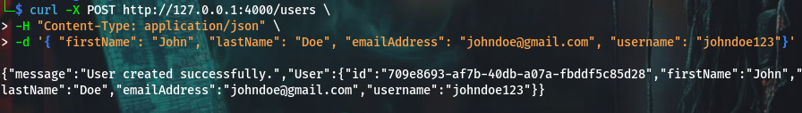
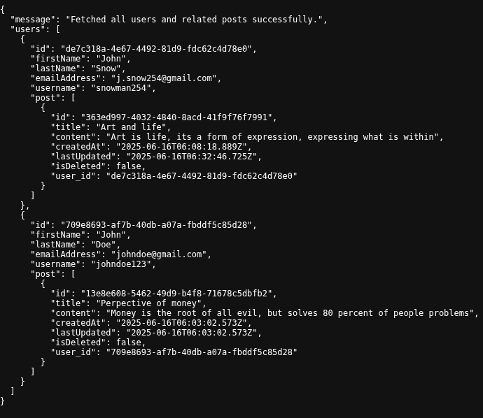
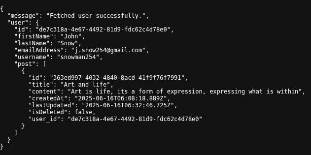
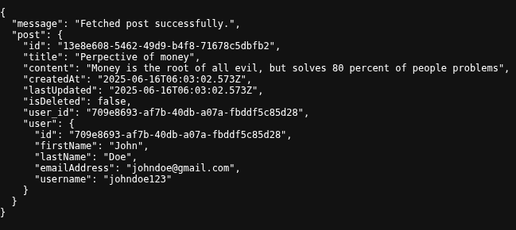

# 🛠️ Express + Prisma REST API
This is a simple RESTful API built using Express.js and Prisma ORM. It allows you to manage users and posts, with basic CRUD functionality.

##  Features
- Create, and fetch users
- Create, read, update, soft-delete posts
- Includes Prisma-based data models
- Basic error handling and conflict checks

## API Endpoints

### POST /users

Create a new user.



### GET /users
Fetch all users.

Request body.

```json
{   
    "firstName": "John", 
    "lastName": "Snow", 
    "emailAddress": "j.snow254@gmail.com",
    "username": "snowman254"
}
```



### GET /users/:id
Fetch a specific user.



### POST /posts
Create new post.

Request body: 

```json
{ 
    "title" : "What art feels like", 
    "content": "Art is life, its a form of expression, expressing what is within", 
    "userId" : "de7c318a-4e67-4492-81d9-fdc62c4d78e0"
}
```


### GET /posts
Fetch all posts


### GET /posts/:id
Fetch specific post



### PUT /posts/:id
Update specific post

We can either update the post title or content or both is needed

updating the title


# **_HAVE FUN!_**